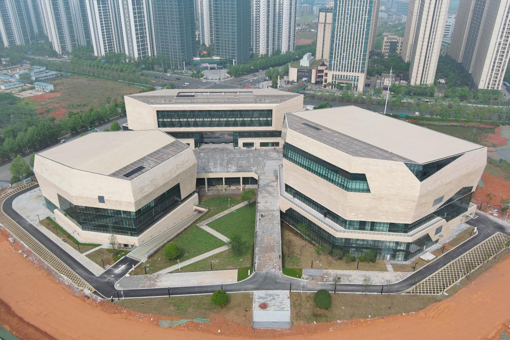








# About me
<!--
Lorem ipsum dolor sit amet, consectetur adipiscing elit. Vivamus ornare aliquet ipsum, ac tempus justo dapibus sit amet.

My research interest includes neural machine translation and computer vision. I have published more than 100 papers at the top international AI conferences with total <a href='https://scholar.google.com/citations?user=DhtAFkwAAAAJ'>google scholar citations <strong>260000+</strong></a> (You can also use google scholar badge ).
-->

I am now a Msc Intelligent Construction student at [The Hong Kong Polytechnic University](https://www.polyu.edu.hk/). Fortunately, I will be supervised by [Prof. JoonOh SEO](https://www.polyu.edu.hk/bre/people/academic-staff/dr-joonoh-seo/) of department of building and real estate, faculty of construction and environment.

My research interest includes construction technology. 

You can find my CV here: [Xudong TANG's Curriculum Vitae](../assets/cv.pdf). If you are interested in my work, please feel free to drop me an [email](mailto:sean.tang12312345@gmail.com).

# 🔥 News
- *2024.09*: &nbsp;🎉🎉 Hong Kong

# 📝 Publications 
<!--

CVPR 2016

[Deep Residual Learning for Image Recognition](https://openaccess.thecvf.com/content_cvpr_2016/papers/He_Deep_Residual_Learning_CVPR_2016_paper.pdf)

**Kaiming He**, Xiangyu Zhang, Shaoqing Ren, Jian Sun

[**Project**](https://scholar.google.com/citations?view_op=view_citation&hl=zh-CN&user=DhtAFkwAAAAJ&citation_for_view=DhtAFkwAAAAJ:ALROH1vI_8AC) <strong></strong>
- Lorem ipsum dolor sit amet, consectetur adipiscing elit. Vivamus ornare aliquet ipsum, ac tempus justo dapibus sit amet. 

- [Lorem ipsum dolor sit amet, consectetur adipiscing elit. Vivamus ornare aliquet ipsum, ac tempus justo dapibus sit amet](https://github.com), A, B, C, **CVPR 2020**
-->

- 🎓During My Master's Research Program

Construction Safety

[Exploring Eye-Tracking Measurement for Construction Hazard Warnings](https://ieeexplore.ieee.org/document/10217826)

**Xudong TANG**, xx, xx

[**Project**](https://ieeexplore.ieee.org/document/10217826) | <strong>SCI Journal Paper</strong>
- IEEE Access, vol. 11, pp. 87732-87746, 2023, doi: 10.1109/ACCESS.2023.3305453.

# 🎖 Honors and Awards
- *2021.08* Huashu Cup National Mathematical Modelling Competition, First Price.

# 📖 Educations
- *2024.09 - Now*, The Hong Kong polytechnic University, Msc Intelligent Construction
<!--
# 💬 Invited Talks
- *2021.06*, Lorem ipsum dolor sit amet, consectetur adipiscing elit. Vivamus ornare aliquet ipsum, ac tempus justo dapibus sit amet. 
- *2021.03*, Lorem ipsum dolor sit amet, consectetur adipiscing elit. Vivamus ornare aliquet ipsum, ac tempus justo dapibus sit amet.  \| [\[video\]](https://github.com/)
-->
# 💻 Internships
- 🎓During My Bachelor's Research Program

Changsha

[Changsha Unban Planning](https://www.csgky.net)

**Department of Architecture Design | Assistant Architect**
- Advised by Mr. Yang
- July. 2019 - Oct. 2019

